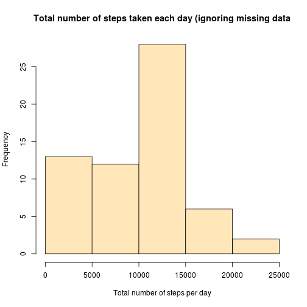
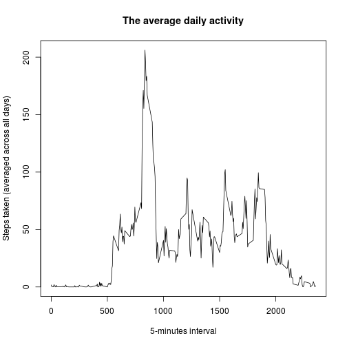
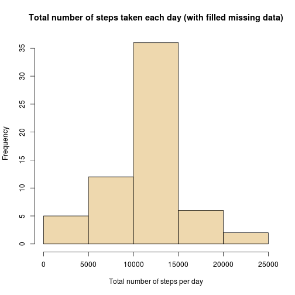
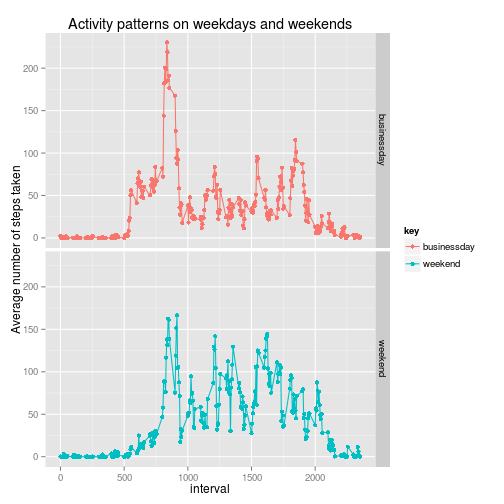

Personal activity monitoring
============================

## Preparations

### Downloading and unzipping the data

First, we need to download the data archive from the web-site. The data archive will be stored
in the currect directory in "Dataset.zip". 
*We cache this operation because we do not want to download the data each time we create the HTML file from this markdown.*

```r
url <- "http://d396qusza40orc.cloudfront.net/repdata%2Fdata%2Factivity.zip"
download.file(url, destfile = "./Dataset.zip")
```

Then, we need to unzip the downloaded data archive. The data will be unzipped to current directory. To check that the extraction of the data went well, we will print out the names of the files we have in the current directiory. *We cache this chunk of the code, too.*

```r
unzip("./Dataset.zip")
print(list.files(recursive = TRUE))
```

```
## [1] "activity.csv"      "Dataset.zip"       "PA1_template.html"
## [4] "PA1_template.md"   "PA1_template.Rmd"
```

### Reading and processing the data

Now we read the data to a data table. We will print the summary of the data, display its structure, and view first 6 observations. *The chunk is cached.*

```r
data <- read.table(file = "activity.csv", header = TRUE, sep = ",", nrows =  17568, na.strings = NA)
summary(data)
```

```
##      steps                date          interval     
##  Min.   :  0.00   2012-10-01:  288   Min.   :   0.0  
##  1st Qu.:  0.00   2012-10-02:  288   1st Qu.: 588.8  
##  Median :  0.00   2012-10-03:  288   Median :1177.5  
##  Mean   : 37.38   2012-10-04:  288   Mean   :1177.5  
##  3rd Qu.: 12.00   2012-10-05:  288   3rd Qu.:1766.2  
##  Max.   :806.00   2012-10-06:  288   Max.   :2355.0  
##  NA's   :2304     (Other)   :15840
```

```r
str(data)
```

```
## 'data.frame':	17568 obs. of  3 variables:
##  $ steps   : int  NA NA NA NA NA NA NA NA NA NA ...
##  $ date    : Factor w/ 61 levels "2012-10-01","2012-10-02",..: 1 1 1 1 1 1 1 1 1 1 ...
##  $ interval: int  0 5 10 15 20 25 30 35 40 45 ...
```

```r
head(data)
```

```
##   steps       date interval
## 1    NA 2012-10-01        0
## 2    NA 2012-10-01        5
## 3    NA 2012-10-01       10
## 4    NA 2012-10-01       15
## 5    NA 2012-10-01       20
## 6    NA 2012-10-01       25
```
 
Then, we should transform the date values into the date format. To ensure that it worked, we will print the class of resulted date column and first 6 dates.

```r
data$date <- as.Date(data$date, "%Y-%m-%d")
class(data$date)
```

```
## [1] "Date"
```

```r
head (data$date)
```

```
## [1] "2012-10-01" "2012-10-01" "2012-10-01" "2012-10-01" "2012-10-01"
## [6] "2012-10-01"
```

## Answering the questions

### 1. What is mean total number of steps taken per day?

First, we calculate the total number of steps taken per day ignoring missing values. We print out what we got.

```r
steps_per_day <- with(data, tapply(steps, date, sum, na.rm = T))
str (steps_per_day)
```

```
##  int [1:61(1d)] 0 126 11352 12116 13294 15420 11015 0 12811 9900 ...
##  - attr(*, "dimnames")=List of 1
##   ..$ : chr [1:61] "2012-10-01" "2012-10-02" "2012-10-03" "2012-10-04" ...
```

```r
head (steps_per_day)
```

```
## 2012-10-01 2012-10-02 2012-10-03 2012-10-04 2012-10-05 2012-10-06 
##          0        126      11352      12116      13294      15420
```

Now we make a histogram and print out the mean and median of the total number of steps taken each day.

```r
hist(steps_per_day, xlab = "Total number of steps per day", col = "wheat1", main = "Total number of steps taken each day (ignoring missing data")
```

 

```r
mean(steps_per_day)
```

```
## [1] 9354.23
```

```r
median(steps_per_day)
```

```
## [1] 10395
```
### 2. What is the average daily activity pattern?

First, we need to calculate the average number of steps taken per each 5-minutes interval (averaged across all days). Then we make a plot of intervals and the average numbers of steps taken.

```r
steps_per_interval =  with(data, tapply(steps, interval, mean, na.rm = T))
plot(unique(data$interval), steps_per_interval, type = "l", xlab = "5-minutes interval", ylab = "Steps taken (averaged across all days)", main = "The average daily activity")
```

 

Now, we print out in which 5-minute interval the maximin number of steps (averaged across all days) were taken.

```r
names (which(steps_per_interval==max(steps_per_interval)))
```

```
## [1] "835"
```

### 3. Imputing missing values 
First, we find out how many rows in the data have missing data.

```r
sum(is.na(data))
```

```
## [1] 2304
```

Now we want to fill the missing data with, let's say, the average number of steps taken in the correcponding 5-minutes interval (fortunately, we already know it: `steps_per_interval`). First, we copy `data` to a data table `data_2` (To avoid messing up with the initial data). Second, we add a new column 'steps_per_interval' to the `data_2` table. Third, we fill the missing data in this table.

```r
data_2 <- data
data_2$steps_per_interval =  with(data_2, tapply(steps, interval, mean, na.rm = T))
data_2[is.na(data_2$steps),]$steps <- data_2[is.na(data_2$steps),]$steps_per_interval
```

Now, we use `data_2` to make a new histogram of the total number of steps taken each day. Also, we calculate the mean and median of total number of steps taken per day. It will allow us to compare these values with the estimates from the question 1.

```r
steps_per_day_2 <- with(data_2, tapply(steps, date, sum, na.rm = T))
hist(steps_per_day_2, xlab = "Total number of steps per day", col = "wheat2", main = "Total number of steps taken each day (with filled missing data)")
```

 

```r
mean(steps_per_day_2)
```

```
## [1] 10766.19
```

```r
median(steps_per_day_2)
```

```
## [1] 10766.19
```
Here we can observe that after filling the missing values, the histogram became more skewed toward the mean of the data. 

### 4. Are there differences in activity patterns between business days and weekends?

Here we work with the `data_2` table. First, we create there a new factor column with two levels (“businessday” and “weekend”) indicating whether a given date is a business day or a weekend.

```r
data_2$weekday <- as.factor(weekdays(data_2$date))
levels(data_2$weekday)[levels(data_2$weekday)=="Sunday"] <- "weekend"
levels(data_2$weekday)[levels(data_2$weekday)=="Saturday"] <- "weekend"
levels(data_2$weekday)[levels(data_2$weekday)!="weekend"] <- "businessday"
```

Second, we calculate the average number of steps taken (averaged across all business days or weekend days) in each 5-minutes interval. Then, we represent this statistics in a data frame `df_gathered` which is organized in suitable for plotting format. We print out first several rows of this frame to understand what we got.

```r
steps_per_IntAndWeekday <- with(data_2, tapply(steps, list(interval, weekday), mean, na.rm = T))
library(tidyr)
library(dplyr)
df <- as.data.frame(steps_per_IntAndWeekday)
df <- mutate(df, interval = as.integer(dimnames(steps_per_IntAndWeekday)[[1]]) )
df_gathered <- gather(df, , ,-interval)
head(df_gathered)
```

```
##   interval         key      value
## 1        0 businessday 2.25115304
## 2        5 businessday 0.44528302
## 3       10 businessday 0.17316562
## 4       15 businessday 0.19790356
## 5       20 businessday 0.09895178
## 6       25 businessday 1.59035639
```

Finally, we make a panel plot containing a time series plot of the 5-minute intervals (x-axis) and the average number of steps taken, averaged across all business days or weekend days (y-axis). Since the factor `weekday` has two levels ("businessday" and "weekend"), we will get two separate plots. We use for that the `gglot2` system.

```r
library(ggplot2)
g <- ggplot(df_gathered, aes(interval, value))
print(g+geom_line(aes(group=key, col=key)) +geom_point(aes(col=key)) +facet_grid(key~.)+
          labs(title = "Activity patterns on weekdays and weekends") +
          labs(y = "Average number of steps taken"))
```

 

We can observe that the average activity of the person is higher on weekends!
